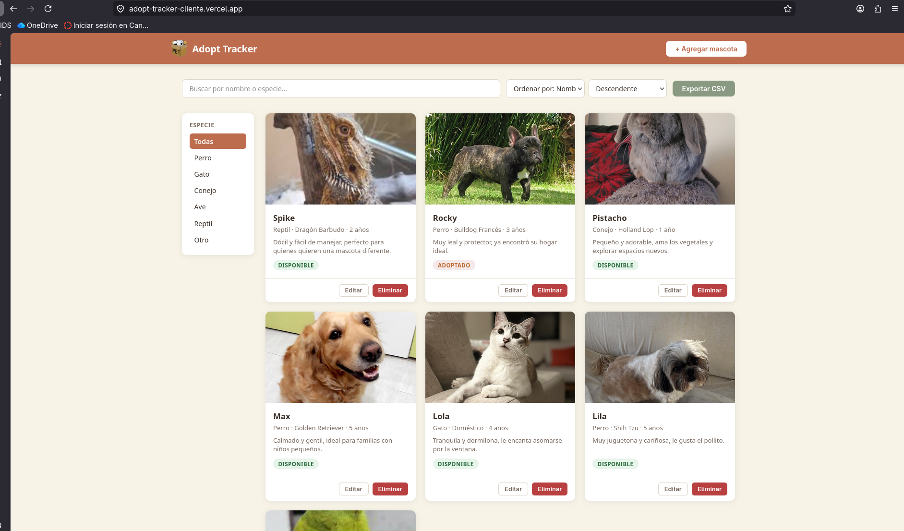

# Adopt Tracker — Cliente

Frontend para la gestión de mascotas en adopción. Consume la [API REST de Adopt Tracker](https://github.com/IvanaFD/adopt-tracker-api).

**Demo:** https://adopt-tracker-cliente.vercel.app

## Screenshots




## Funcionalidades

- Listado de mascotas con búsqueda, filtro por especie y ordenamiento
- Paginación con navegación por páginas
- Modal de detalle al hacer clic en una card
- Crear, editar y eliminar mascotas con subida de imagen
- Exportar el listado actual a CSV

## Tecnologías

Vanilla HTML, CSS y JavaScript. Sin frameworks ni dependencias. Sin build step.

## Estructura

```
├── index.html
├── css/
│   └── styles.css
├── assets/
│   └── logo.svg
└── js/
    ├── api.js          # Todas las llamadas a la API
    ├── main.js         # Estado, eventos y lógica principal
    ├── ui/
    │   ├── cards.js       # Render de tarjetas
    │   ├── modal.js       # Modales (detalle, formulario, confirmación)
    │   ├── pagination.js  # Render de paginación
    │   └── toast.js       # Notificaciones
    └── utils/
        ├── csv.js         # Exportación a CSV
        └── escape.js      # Sanitización de HTML
```

## Correr localmente

El sitio usa `fetch`, por lo que no puede abrirse directamente como archivo. Necesita un servidor local:

```bash
npx serve .
```


## API

Conecta con `https://adopt-tracker-api.vercel.app`. Para apuntar a otra instancia, cambiá la constante `API_URL` en `js/api.js`.

## Challenges implementados

- Calidad visual del cliente
- Organización del código en archivos con responsabilidades claras
- Exportar lista a CSV generado manualmente desde JavaScript, sin librerías
- Subida de imágenes (máx. 1MB, almacenadas en Cloudinary vía la API)

## Reflexión

Era la primera vez que construía una interfaz tan completa usando únicamente JavaScript vanilla, sin ningún framework ni librería. Fue útil para entender cómo funcionan el DOM y el fetch nativo por debajo. La desventaja más clara apareció a medida que la app crecía: manejar el estado, los eventos y los distintos modales de forma manual se vuelve difícil de seguir, algo que con React o Vue estaría mucho más ordenado. Para proyectos pequeños lo volvería a usar, pero para algo más grande preferiría un framework.

## Repositorio API

https://github.com/IvanaFD/Proyecto-web-backend


